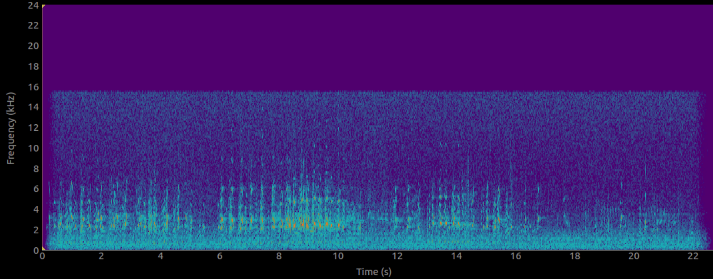
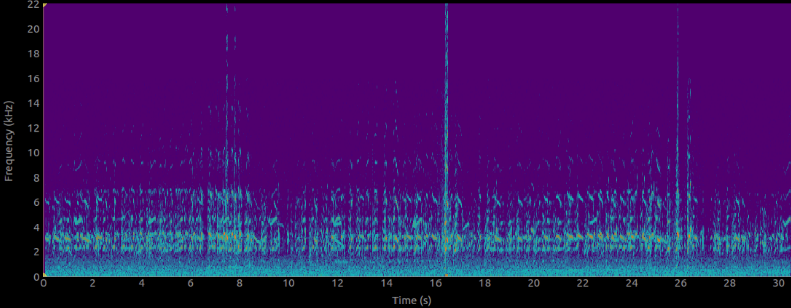
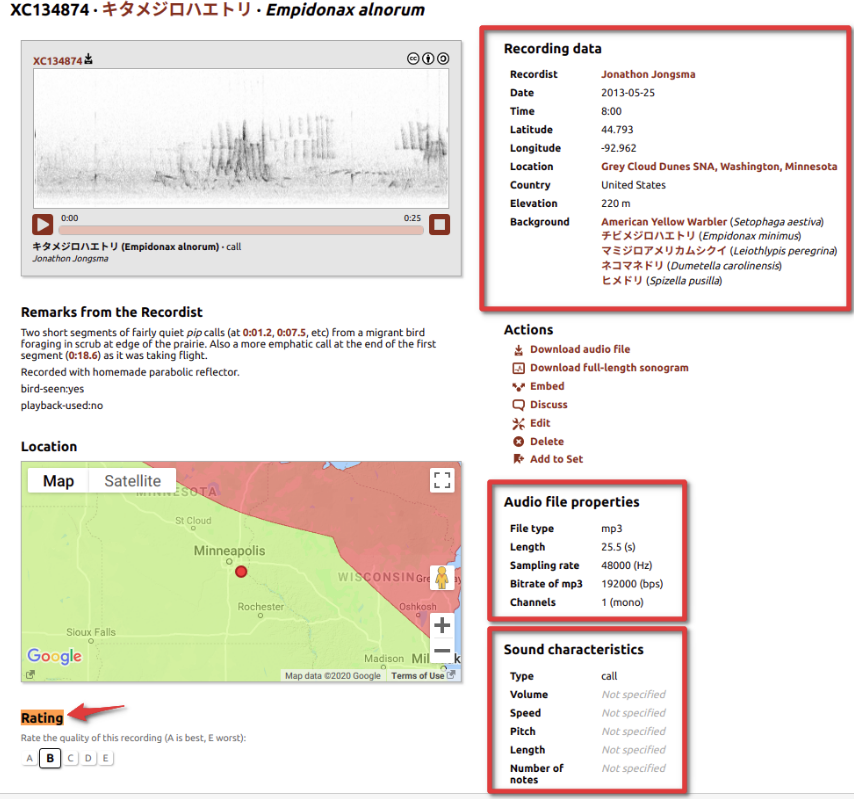
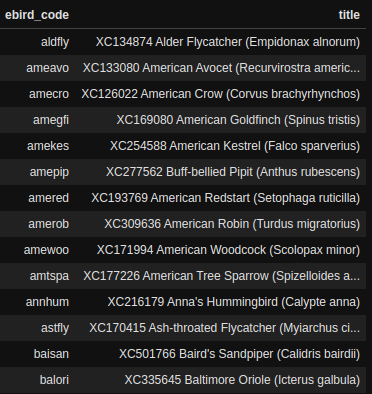
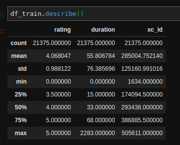
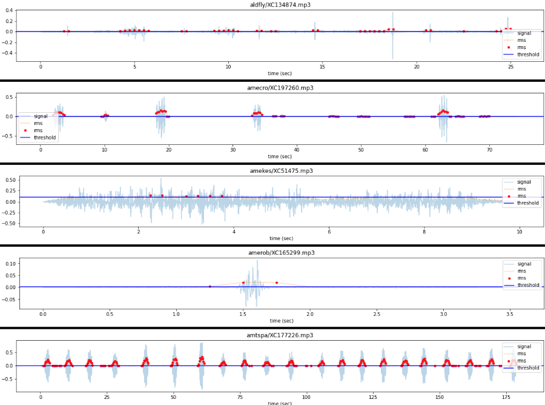

<!--  -->

# kaggle-Cornell-Birdcall-Identification
Cornell Birdcall Identification コンペのリポジトリ

## Info
- google slide: https://docs.google.com/presentation/d/1ZcCSnXj2QoOmuIkcA-txJOuAlkLv4rSlS7_zDj90q6c/edit#slide=id.p
- ref:
  - metricについて: https://www.kaggle.com/shonenkov/competition-metrics

## Features
|Name|shape (feat only)|size(MB)|Detail|
|---|---|---|---|
|nb004_librosa_mfcc.csv|(21,375, 11)|2.0|librosaのmfcc(2~12)。audiofile1つにつき1ベクトル。srを揃えてないので周波数空間の大きさに差が有り問題がありそう。srを16kHzとかにそろえたほうがいいと思う。|
|nb007_librosa_mfcc02.csv|(4,779,859, 11)|436.1|nb004の特徴量の拡張。audiofile内のn_feat/m_audio/1_bird。nb004の特徴量よりかなりデータ数が多い。|
|nb008_librosa_basic|(4,779,859, 12)|482.7|['rms', 'centroid', 'sc_1', 'sc_2', 'sc_3', 'sc_4', 'sc_5', 'sc_6', 'sb', 'sf', 'sr', 'zcr']。nb004と同じくsrを揃えていない問題がある。|
|nb010_librosa_rms.csv|(4779859, 3)|144|event部分だけ抽出する際のthresholdとして使う。|

## Memo
- term
  - nb: ノートブック
  - kagglenb: kaggleのサイトで見れる/作れるノートブック
- public LBの54%がnocallらしい。(https://www.kaggle.com/c/birdsong-recognition/discussion/159492)
- 

## Basics
**overview(DeepL)**

窓の外で鳥のさえずりが聞こえてきませんか？世界には1万種以上の鳥が生息しており、手つかずの熱帯雨林から郊外、さらには都市部まで、ほぼすべての環境に生息しています。鳥は自然の中で重要な役割を果たしています。鳥は食物連鎖の上位に位置し、下層で発生している変化を統合します。そのため、鳥は生息地の質の低下や環境汚染の指標として優れています。しかし、鳥は目で見るよりも耳で聞く方が簡単なことが多い。適切な音の検出と分類があれば、研究者は鳥の個体数の変化に基づいて、その地域の生活の質に関する要因を自動的に直感的に把握することができます。

自然の音風景を長期間にわたって連続的に記録することで、鳥類を広範囲に監視するプロジェクトがすでに多く進行中である。しかし、多くの生物や非生物はノイズを発生させるため、これらのデータセットの分析は、多くの場合、専門家が手作業で行っています。このような分析は非常に時間がかかり、結果も不完全なものになりがちです。データサイエンスが助けになるかもしれないので、研究者たちはAIモデルを訓練するために、鳥類の集音録音の大規模なクラウドソースのデータベースに目を向けている。しかし残念なことに、トレーニングデータ（個々の鳥の短い録音）と、モニタリングアプリケーションで使用されるサウンドスケープ録音（複数の種が同時に鳴いていることが多い長い録音）の間には、領域的なミスマッチがあります。これが、現在使用されているAIモデルの性能が低い理由の一つです。

これらの広範で情報量の多いサウンドアーカイブの可能性を最大限に引き出すためには、研究者は、データ駆動型の保存を支援するために、可能な限り多くの情報を確実に抽出する優れた機械リスナーが必要です。

コーネル大学鳥類学研究所の保全生物音響センター（CCB）の使命は、自然界の音を収集し、解釈することです。CCB は革新的な保全技術を開発し、世界中の野生生物や生息地の保全に貢献しています。CCBはデータサイエンスのコミュニティと協力して、その使命をさらに高め、サウンドスケープ分析の精度を向上させたいと考えています。

このコンテストでは、サウンドスケープの録音物に含まれる多種多様な鳥の発声を特定します。録音が複雑なため、ラベルが弱いものが含まれています。人為的な音（例：飛行機の空飛ぶ音）やその他の鳥や非鳥の鳴き声（例：シマリスの鳴き声）が背景にあり、ラベル付けされた特定の鳥の種が前景にあるかもしれません。複雑なサウンドスケープの録音を分析するための効果的な検出器と分類器を構築するために、あなたの新しいアイデアを持ってきてください!

成功すれば、あなたの研究は、研究者が生息地の質の変化、汚染のレベル、修復作業の効果をよりよく理解するのに役立ちます。信頼性の高い機械リスナーはまた、保全活動家が世界中でより多くの録音ユニットを展開することを可能にし、まだ不可能な規模でのデータ駆動型の保全を可能にします。最終的な保全の成果は、鳥類や人間を含む多くの生物の生活の質を大きく向上させる可能性があります。

**data(deepL)**   
隠されたtest_audioディレクトリには、MP3形式の約150の録音が含まれています。これらの録音はノートパソコンのメモリには同時に収まりません。録音は北米の3つの離れた場所で行われました。サイト1と2は5秒単位でラベル付けされており、予測値と一致する必要がありますが、ラベル付けプロセスに時間がかかるため、サイト3のファイルはファイルレベルでのみラベル付けされています。そのため、サイト3はテストセットの行数が比較的少なく、より低い時間分解能の予測が必要です。 別のデータソースからの2つのサウンドスケープの例も、サウンドスケープがどのようにラベル付けされているかと、隠しデータセットのフォルダ構造を説明するために提供されています。2つの例の音声ファイルはBLKFR-10-CPL_20190611_093000.pt540.mp3とORANGE-7-CAP_20190606_093000.pt623.mp3です。これらのサウンドスケープは、カリフォルニア科学アカデミー鳥類哺乳類学科のJack Dumbacher氏のご厚意により提供されました。

### train.csv colomn infomaiton
notebook: nb001
example: https://www.xeno-canto.org/134874

|name|Explanation|
|----|----|
|rating|録音の質を表す(A,B,C,D,Eの5段階)|
|playback_sed|...|
|ebird_code|名前。nunique=264|
|channels|チャンネル数。2種類('1 (mono)', '2 (stereo)')|
|date|録音日。yyyy-mm-ddで記述されている。<-- すべてそうなってるかは確認していない。|
|pitch|'Not specified', 'both', 'increasing', 'level', 'decreasing'の5種類。nb001でそれぞれの音を聞いてみた。(log20200730), 正直何を表しているかわからん。|
|duration|audioファイルの再生時間。単位はseconds。|
|filename|そのままの意味。filenameにかぶりはなし(nb001)。|
|speed |Not specified, level, both, accelerating, decelerating の5種類。音を聞いたけど何が違うのか全然わからん。 |
|species|264種類。今回のクラス数と一緒だな。ebird_codeと一対一？|
|number_of_notes|サイト見たけど、何の数かわからん。['Not specified', '1-3', '4-6', '7-20', '>20']の5種類|
|title|\<filename> \<鳥名> ?? の形式で書かれている。|
|secondary_labels|メインの鳥の鳴き声以外のラベル。|
|bird_seen|集音時に鳥を見たかどうか。|
|sci_name|学名？|
|location|集音場所|
|latitude|緯度|
|sampling_late|サンプリングレート|
|type|song, call, fightなどある|
|elevation|標高。'1400 m' みたいな感じで入ってるが、string型。'? m' もある。|
|descriptin|audiofileにかかれているメタデータ。|
|bitrate_o_mp3|stringで'128000 (bps)'のように格納されているが、8個だけNaNになっている(nb001)|
|file_type|4種類。それぞれの個数はmp3=21367, wav=6, mp2=1, aac=1となっている。|
|volume|'Not specified', 'both', 'increasing', 'level', 'decreasing'の5種類。またこの指標出た。意味がわからん。|
|background|背景音。xeno-cantにも記述されている。secondaly_labelsとどう違うのだろうか。|
|xc_id|filenameにある、XCと拡張子を除いた部分。例(XC134874.mp3 の134874がそれに当たる。重複なく各要素はユニーク。)|
|url    |xeno-cant へのリンクURL|
|country|集音した国|
|author|集音者|
|primary_label|ebird_code は primary_labelの略っぽい。例: Empidonax alnorum_Alder Flycatcher	--> aldfly|
|longitude|経度|
|length|'Not specified', '0-3(s)', '6-10(s)', '>10(s)', '3-6(s)' が要素にある。'Not specified' がダントツで多い。|
|time|集音開始時刻。朝が多め。|
|recordist|調べてみたら(nb001)、authorとrecordistは完全に一致してた。|
|license|4種類あった。あまり有用な情報ではないだろう。|

## Log
### 20200726
- join!!
- spectrogram-treeを使って確認してる。
  - フィルタが入ってるデータとか多いな...

| not filter                                                                  | filter                                                                      |
| --------------------------------------------------------------------------- | --------------------------------------------------------------------------- |
|  |  |
|  |  |
|                                                                             |                                                                             |

- なんか音声ファイルにコメントがあったぞ。

- うーん。とりあえず、提出方法を理解してみよう。

### 20200727
- テストデータはカーネルにしかないのか？
- train.csv
  - nb001
  - train.csvのよくわからないカラムの意味は[ここ](https://www.xeno-canto.org/134874)見ればよさそう。

  | train.csv   | train.csvに記載のurl先  |
  | --- | --- |
  |     |   |
  - playback_used と bird_seen のnull数が一致してる。
  - secondary_labelには、メイン(primary_label)以外の鳥の鳴き声などが入ってる...。どうすんのこれ。
  - bird_seen がNoなのは、声は聞いたが見ていないということ。
  - filetypeはわずかだが、mp3以外もあるようだ
  
### 20200729
- discussionにlibroa.load()について投げた
    - https://www.kaggle.com/c/birdsong-recognition/discussion/170749

### 20200730
- xeno-cantoのレーティングの目安
    A: Loud and Clear
    B: Clear, but bird a bit distant, or some interference with other sound sources
    C: Moderately clear, or quite some interference
    D: Faint recording, or much interference
    E: Barely audible

- nb001
    - pitchの、increasing, decreasing, both, level の確認を行った
    - ebird_codeと鳥名の関係がわかった。ebird_codeは鳥名の略。
      

### 20200731
- nb001
  - secondaly_labelsはxeno_cantに情報がなかった。たぶんaudiofileのメタデータから取得したっぽいな。
  - 集音場所をマップに落とすことやってみたかったので、issueにした。
  - secondaly_labelsとbackgroundの違いがよくわからなかったのでissueにした。

### 20200801
- pub-kaggle-nbを見ながらどうやってサブするのかを見た。
  - prv-kaggle-nb でテストデータにアクセスできるが、ここには3つのデータしか開示されない。
  - このサンプルを参考にprv-kaggle-nbを提出する。
  - すると、提出先では完全なテストデータがノートブックに与えられてしっかり評価される。
  - なるほどこういう仕組みか。
  - kaggle-nb でsubする場合は、internet=Off にする必用がある。

- test_audio
  - 10minぐらいのmp3 fileが150個程度ある
  - siteは3つある
    - 1,2は5secごとにラベルがふられている。
    - site 2 は file単位でラベルが振られている。

- このノートブックではチェック用のデータ・セットが配られている。
  - https://www.kaggle.com/shonenkov/sample-submission-using-custom-check
  - submit する前のチェックに使える。

- libros.load() の引数にres_typeというものがある。リサンプルのタイプだ。res_type=’kaiser_fast’で早くすることもできる。

- durationのminに0秒があるな  
  

- kagglenb_02_sub
  - first sub
  - このノートブック動かしただけ: https://www.kaggle.com/cwthompson/birdsong-making-a-prediction
  - score
    - cv: xxx
    - sub: 0.002
    - rank: 591/601

- 外部データ・セット(726424_1262046_bundle_archive.zip)をダウンロード
  - url: https://www.kaggle.com/shonenkov/birdcall-check
  - birdcall check と呼ばれてる

- nb004
  - 初めての特徴量を作成した。
  - librosaのmfcc(2~12)。
  - m_feat/m_audiofile/1_ebird
  - 1つのwavからはフレームごとにmfccを得られるがそれを平均化した。

- nb005
  - スペクトログラムを画像で保存するためのコードを書いた。
  - 画像を27000枚ほど作らなければいけなかったのでdpiを小さくした。
  - メモリリークが微妙に防げない...

### 20200802
- nb006
  - nb004 で作成した特徴量を使ってrfcモデルを作成する。
  - モデルを5つ、infoを1つ保存した。
    - info
      - featsets (今回は、nb004_librosa_mfcc.csv)
      - feat_names (↑のfeatsetsから何かを除いたりすることもあると思うので)
    - models (モデルがfold分格納されている)
      - size: 37x5MB

- nb007
  - nb004で作成した特徴量の拡張版
  - n_feat/m_wav/1_bird にした。
  - window_sizeとstrideは0.5, 0.25 sec
  - nb004の特徴量よりデータ数がかなり多い。
    - shape: (4,779,859, 11)
    - time: 2:51:06

### 20200803
- kagglenb_02_nocall_only
  - nocall だけでsubmitしてみた
  - result
    - cv: none
    - sub: 0.544

- このSample Submission File(公式) 見る感じ、複数の鳥が鳴いていればそれを予測するということか。
  - 

- 今後使いそうなNNの初手
  - https://twitter.com/mlaass1/status/1290131798735781890/retweets/with_comments

- nb008
  - librosaの基本的な特徴量を実装。
  - n_feat/m_wav/1_bird
  - w_size=0.5, w_stride=0.25 sec
  - feats
    - ['librosa_rms', 'librosa_centroid', 'librosa_sc_1', 'librosa_sc_2', 'librosa_sc_3', 'librosa_sc_4', 'librosa_sc_5', 'librosa_sc_6', 'librosa_sb', 'librosa_sf', 'librosa_sr', 'librosa_zcr']

 ### 20200804
  - nb006
    - nb004で作成した特徴量を使ってrfcモデルを作成する。
    - feat: nb004_librosa_mfcc
    - model: rfc
    - cv: 5-fold

  - kagglenb_04_sub
    - nb006のモデルを1つだけ使ってsubしてみた
    - result
      - pub: 0.544 (<---閾値大きすぎて全部nocallだったっぽい)

### 20200805
- timeoutになった場合でもsucseedになる可能性がある？
  - https://www.kaggle.com/c/birdsong-recognition/discussion/172042
  - でもこれ議論がわかれてるな。

- カエル先生のことほんとに見習わないといけない
  - https://www.kaggle.com/c/birdsong-recognition/discussion/169538
  - 3/2にデータにはセカンダリラベルがないが、他の種類の鳥が鳴いていることがある。
    - arai さんの対応方法
      > これまでのところ、私のモデルは潜在的な二次ラベルのためにすべての0を出力するようにしています。私は一次二次ラベルを明確に分離していないので、各サンプルに対して264次元の1ホットベクトルを提供し、一次二次ラベルに対応する位置に1を配置します。サンプルが二次ラベルを持たない場合は、一次ラベルに対応する位置を除いてすべての要素が0であるベクトルを作成します。

  
- カエル先生がそれぞれどのような戦略をとればいいかアドバイスしてくれてる。
  - https://www.kaggle.com/c/birdsong-recognition/discussion/170959#951943

### 20200806
- tawaraさんのリサンプリングデータセットをダウンロードした
  - https://www.kaggle.com/c/birdsong-recognition/discussion/164197
  - size: 72GB
- 今日はディスカッションを眺めるだけで終わってもうた。

### 20200807
- 今日は、pytorchの本でdataloderの勉強とかしてた。
- ノイズ除去を扱ってるノートブック
  - https://www.kaggle.com/takamichitoda/birdcall-noise-reduction
  - noisereduceというライブラリがあるらしい。
- ノイズ除去を扱ってるディスカション
  - https://www.kaggle.com/c/birdsong-recognition/discussion/169582#946072

### 20200809
- tawaraさんのResNestのTrainingノートブックを見てた
  - fold 0 で学習(fold 1to4) で評価というのをやってた。
  - モデル2つで推論とか厳しいのかな...

### 20200810
- mono_to_color は画像ごとに行っているけど大丈夫かな...

- nb009
  - tawaraさんの[trainingノートブック](https://www.kaggle.com/ttahara/training-birdsong-baseline-resnest50-fast?)を理解するためのノートブック
  - ある程度理解できたと思う。
- pytorch でCNNつくってるノートブック(https://www.kaggle.com/radek1/esp-starter-pack-from-training-to-submission)
  - これも参考になる。

- nb010
  - nb009を参考にresnetでモデルを学習してみる
  - めっちゃ遅い。1epoch 12minぐらいかかる。
  - tawaraさんのやつは1minぐらいっぽいけどほんとか？

### 20200811
- nb010
  - 昨日でてきた疑問(1epoch 12min問題に取り組む)
    - issue: https://github.com/fkubota/kaggle-Cornell-Birdcall-Identification/issues/50
    - kaggle-notebook で動かしてみたけど同じぐらい遅かった。他に原因あり？
    - tawaraさんのノートブックちゃんと見たら学習に8hほどかかっていたことがわかった。
    - 1epochあたり10min前後。
    - こんなもんか。
    - result
      - n_epoch: 50
      - time: 10 h
      

### 20200812
- 評価指標について説明されてる[ディスカッション](https://www.kaggle.com/shonenkov/competition-metrics)
  - サンプル平均？のf1_score?

- かえる先生がvalidationについて言及している[ディスカッション](https://www.kaggle.com/c/birdsong-recognition/discussion/170959#951943)
  - ↑に対しての[アライさんのコメント](https://www.kaggle.com/c/birdsong-recognition/discussion/171247)

- kagglenb05(www.kaggle.com/fkubota/kagglenb05-from-nb010)
  - nb010で作成したモデルを提出してみる
  - version5
    - probaあたりでミスってスコア0.326だった
  - version7
    - version5のミスを修正した
    - スコアは0.490

### 20200813
- nb011
  - bawwar/XC472332.mp3 でエンジン音？のようなものが聞こえた。bawwarのデータが大体そうなのかを確認してみる。
  - 1.3 \* med(librosa_rms) を閾値として、event部分を取り出してみた。結構いい感じ。
      

- nb012
  - SpectrogramEventRmsDataset の作成
  - nb011でのevent検出を活かしたデータセット。
  - フロー図
      
  - 実行時間
    - dataset のイテレータ全て実行した場合
      - SpectrogramEventRmsDataset: 14min 28s
      - SpectrogramDataset: 49min 50s
    